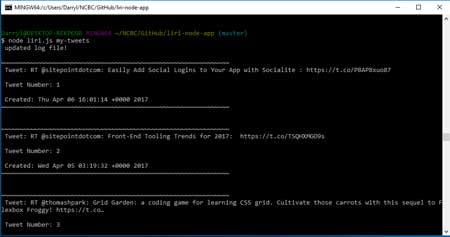

# liri node app
Week 10 (LIRI Bot) LIRI is a Language Interpretation and Recognition Interface.

LIRI is like iPhone's SIRI. However, while SIRI is a Speech Interpretation and Recognition Interface, LIRI is a Language Interpretation and Recognition Interface. LIRI will be a command line node app that takes in parameters and gives you back data.

## What Each Command Should Do
### node liri.js my-tweets

This will show your last 20 tweets and when they were created at in your terminal/bash window.

### node liri.js spotify-this-song '<song name here>'

This will show the following information about the song in your terminal/bash window

   * Artist(s)
   * The song's name
   * A preview link of the song from Spotify
   * The album that the song is from

if no song is provided then your program will default to
"The Sign" by Ace of Base

### node liri.js movie-this '<movie name here>'

This will output the following information to your terminal/bash window:
   * Title of the movie.
   * Year the movie came out.
   * IMDB Rating of the movie.
   * Country where the movie was produced.
   * Language of the movie.
   * Plot of the movie.
   * Actors in the movie.
   * Rotten Tomatoes Rating.
   * Rotten Tomatoes URL.

If the user doesn't type a movie in, the program will output data for the movie 'Mr. Nobody.'

### node liri.js do-what-it-says 

Using the fs Node package, LIRI will take the text inside of random.txt and then use it to call one of LIRI's commands. 

It should run spotify-this-song for "I Want it That Way," as follows the text in random.txt.

Feel free to change the text in that document to test out the feature for other commands.

### BONUS

In addition to logging the data to your terminal/bash window, output the data to a .txt file called log.txt.

Make sure you append each command you run to the log.txt file. 
Do not overwrite your file each time you run a command.